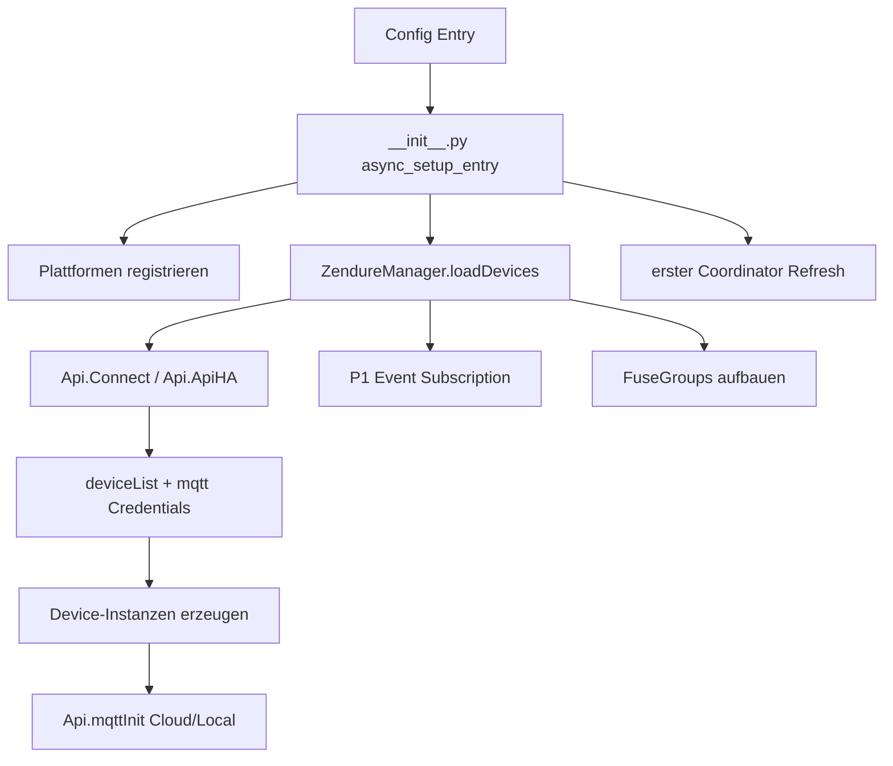
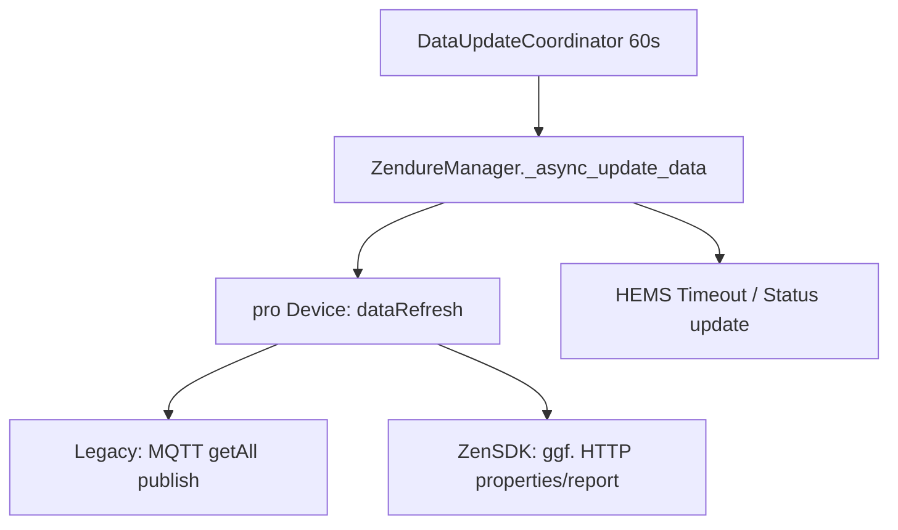
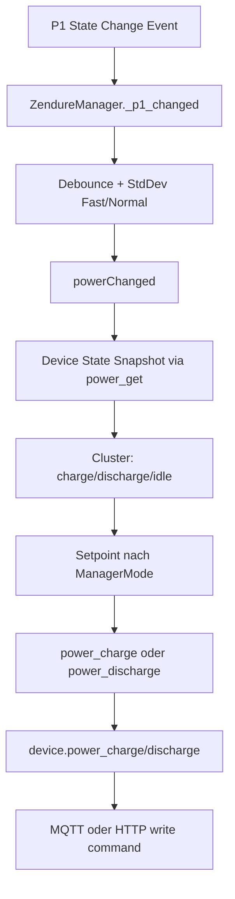

# Datenflussanalyse Zendure-HA

## 1. Hauptdatenstroeme

### 1.1 Initialer Setup-Flow


### 1.2 Periodischer Refresh-Flow


### 1.3 MQTT-Ingress-Flow
```mermaid
flowchart TD
    A[MQTT Message Cloud/Local] --> B[Api.mqttMsgCloud / mqttMsgLocal]
    B --> C[Topic Parsing + JSON Decode]
    C --> D[Api.devices[deviceId]]
    D --> E[device.mqttMessage(subtopic,payload)]
    E -->|properties/report| F[device.mqttProperties]
    F --> G[properties[] iterieren]
    G --> H[entityUpdate(key,value)]
    H --> I[Entity state update in HA]
    F --> J[packData -> ZendureBattery Entities]
```

### 1.4 Lastmanagement-Flow (P1)


## 2. Quellen und Senken

### Datenquellen
- Zendure Cloud (`Api.ApiHA`) fuer Device-Liste und Cloud-MQTT.
- MQTT-Telemetrie (`properties/report`, `properties/energy`, etc.).
- Lokales HTTP (`ZendureZenSdk.httpGet`) fuer ZenSDK-Status.
- Home Assistant P1-Sensor als Trigger fuer aktive Leistungssteuerung.

### Datensenken
- HA Entity States (Sensor/Binary/Number/Select/Switch/Button).
- Device Commands ueber MQTT (`properties/write`, `function/invoke`).
- Device Commands ueber HTTP (`properties/write`) bei ZenSDK.
- Optional `simulation.csv` bei aktivierter Simulation.

## 3. Kontrollfluss nach Betriebsmodus
- `ManagerMode.OFF`: keine aktive Leistungsregelung, Devices werden abgeschaltet.
- `ManagerMode.MANUAL`: fixer manueller Setpoint (`manual_power`).
- `ManagerMode.MATCHING`: bidirektionales Matching auf Netz-Setpoint.
- `ManagerMode.MATCHING_DISCHARGE`: nur entladen.
- `ManagerMode.MATCHING_CHARGE`: laden, bei produzierter Leistung optional entladen.
- `ManagerMode.STORE_SOLAR`: Fokus auf Laden/Store-Verhalten.

## 4. Timing und Entkopplung
- **Schneller Triggerpfad**: P1-Events (entkoppelt vom 60s Polling).
- **Regulaerer Pfad**: Coordinator-Polling fuer Grundaktualisierung.
- **Asynchroner Ingress**: MQTT-Callbacks landen ueber Thread->Loop-Uebergang (`run_coroutine_threadsafe`) in HA-Loop.
- **Hysterese/Filter**: `SmartMode`-Schwellen fuer verrauschte P1-Daten.

## 5. Typische End-to-End-Szenarien

### Szenario A: Neues Telemetriepaket
1. Device sendet `properties/report` per MQTT.
2. API-Router ordnet Paket Device zu.
3. Device mapped Keys auf Entities (dynamisch oder vorhanden).
4. HA zeigt neue Werte; Aggregatsensoren werden fortgeschrieben.

### Szenario B: Netzbezug steigt ploetzlich
1. P1-Sensor meldet Lastsprung.
2. Manager erkennt schnellen Wechsel (StdDev).
3. `power_discharge()` verteilt Setpoint ueber geeignete Devices.
4. Devices erhalten model-spezifische Commands.

### Szenario C: ZenSDK lokal ohne Cloud
1. Connection-Select auf ZenSDK.
2. `power_get()` holt Zustand per HTTP.
3. Schreiboperationen gehen auf `http://<ip>/properties/write`.
